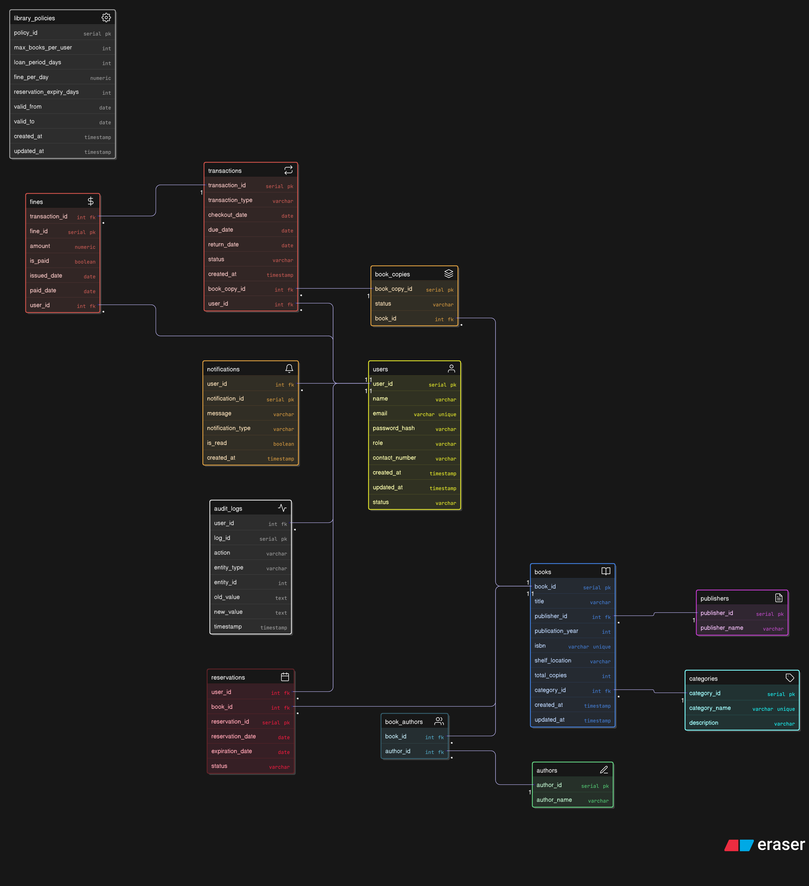

## 1. Users & Roles
**User Roles:**
- **Admin**: Manages staff accounts, views analytics and reports.
- **Librarian**: Manages books, handles lending and returns, manages fines.
- **Member**: Searches books, views availability, locates books in library.
- **Guest**: No access to search or library functions.

**Access Control:**
- Admin has full privileges.
- Librarian has restricted management privileges (no access to admin settings).
- Members can only view and borrow books as per rules.
- Guests have no functional access.

**Account Creation:**
- Only staff can create accounts for members.
- Staff accounts are created by Admin.
- No self-registration.

**Staff Borrowing Rules:**
- Staff accounts can also have member privileges for borrowing (frontend-controlled).

---

## 2. Book Lending Rules
- **Checkout Eligibility:** Only staff can perform checkout on behalf of members.
- **Self-checkout:** Not supported.
- **Borrowing Limit:** Max **5 books** per member.
- **Loan Period:** 14 days (same for all users).
- **Renewals:** 1 renewal allowed per book.
- **Late Returns:**
  - Fine: Rs.5/day until returned.
  - Borrowing blocked until fine is cleared.
- **Reservations:** Supported.
  - If reserved, the member gets priority when returned.
  - Reservation notification sent to member.

---

## 3. Inventory Management
- System tracks **multiple copies** of the same book as individual records (each copy has unique ID).
- Tracks condition of each copy (Good, Damaged, Lost).
- Damaged/lost books require manual action by librarian.

---

## 4. Returns
- Only the **original borrower** can return a book.
- Librarian inspects books upon return and updates condition.

---

## 5. Notifications
- **Due Date Reminders:** Sent 2 days before due date.
- **Overdue Alerts:** Sent daily until returned.
- **Reservation Ready:** Sent when reserved book is returned and available.

---

## 6. Reports & Analytics
System generates analytics on:
- Most borrowed books.
- Overdue counts.
- Active members.
- Inventory changes.

---

## 7. Access & Availability
- Web-based application (initial version).
- Accessible from both inside and outside library network (requires authentication).

---

## 8. Additional Business Rules
- Fine accumulation has no upper cap.
- Borrowing suspended if outstanding fines exist.
- Reservation queue maintained if multiple members reserve same book.

---

## 9. Edge Case Handling
- **Lost Books:** Marked as lost, borrowing suspended until resolved.
- **Damaged Books:** Status updated, may incur replacement cost.
- **Multiple Reservations:** Handled in FIFO order.
"""

---
## 📌 ERD Diagram

Here’s the database structure for **ShelfWise**:

---

## Entities & Requirements:

1. **User**
   - Fields: user_id (PK), name, email (unique), password_hash, role (ENUM: ADMIN, FACULTY, STUDENT), contact_number, created_at, updated_at, status.
   - Relationships:
     - One User → Many Transactions.
     - One User → Many Reservations.
     - One User → Many Notifications.

2. **Book**
   - Fields: book_id (PK), title, authorid, isbn (unique), publisher(fk), publication_year, category_id (FK → Category), shelf_location, total_copies, created_at, updated_at.
   - Relationships:
     - One Book -> many Author
     - One Book -> one publisher
     - One Book → Many Transactions.
     - One Book → Many Reservations.
     - One Book → Many Category.
    
  
3. **Book Copy**
- Fields : book_copy_id(pk), book_id(FK -> Book), Location, status (ENUM→AVAILABLE, CHECKED_OUT, RESERVED, LOST, DAMAGED)
- Relationships : 
   - Many Book Copy -> one Book

4. **Author**
- Fields : author_id(pk), authorName
- Relationships:
    - Many Author -> Many Book
    
5. **Publisher**:
- Fields : Publisher_id(pk),Publisher_name
- Relationships:
    - One Publisher -> Many Book
    
6. **Category**
   - Fields: category_id (PK), category_name (unique), description.
   - Relationships:
     - One Category → Many Books.

7. **Transaction** *(For checkouts, returns, and renewals)*
   - Fields: transaction_id (PK), user_id (FK → User), book_copy_id (FK → Book_copy), transaction_type (ENUM: CHECKOUT, RETURN, RENEWAL), checkout_date, due_date, return_date, status (ENUM: ACTIVE, COMPLETED, OVERDUE), created_at.
   - Relationships:
     - Many Transactions → One User.
     - Many Transactions → One Book_copy.

8. **Reservation**
   - Fields: reservation_id (PK), user_id (FK → User), book_id (FK → Book), reservation_date, expiration_date, status (ENUM: PENDING, CONFIRMED, CANCELLED, EXPIRED).
   - Relationships:
     - Many Reservations → One User.
     - Many Reservations → One Book.

9. **Fine**
   - Fields: fine_id (PK), transaction_id (FK → Transaction), user_id (FK → User), amount, is_paid (boolean), issued_date, paid_date.
   - Relationships:
     - One Fine → One Transaction.
     - One Fine → One User.

10. **Notification**
   - Fields: notification_id (PK), user_id (FK → User), message, notification_type (ENUM: DUE_REMINDER, RESERVATION_CONFIRMATION, FINE_ALERT, SYSTEM_ALERT), is_read (boolean), created_at.
   - Relationships:
     - Many Notifications → One User.

11. **Library Policy**
   - Fields: Policy_id (PK), max_books_per_user, loan_period_days, fine_per_day, reservation_expiry_days, Valid from ,Valid to (nullable), created_at, updated_at.
   - Purpose: System-wide dynamic configuration controlled by admin.

12. **Audit Log**
   - Fields: log_id (PK), user_id (FK → User), action, entity_type, entity_id, old_value, new_value, timestamp.
   - Purpose: Track changes to critical records.

